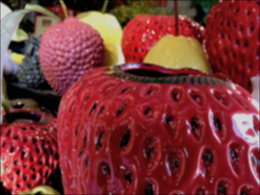

# `gax`

[](https://github.com/octu0/gax/blob/master/LICENSE)
[](https://godoc.org/github.com/octu0/gax)
[](https://goreportcard.com/report/github.com/octu0/gax)
[](https://github.com/octu0/gax/releases)

`gax` is an image processing framework.  
`gax` provides a [Halide](https://halide-lang.org) like interface and reduces size of the image processing code.

## Overview

### Halide Code

```c++
using namespace Halide;

Func blur_3x3(Func in) {
	Var x, y, c;

	Func blur_x;
	blur_x(x, y, c) = (in(x-1, y, c) + in(x, y, c) + in(x+1, y, c))/3;

	Func blur_y;
	blur_y(x, y, c) = (blur_x(x, y-1, c) + blur_x(x, y, c) + blur_x(x, y+1, c))/3;

	return blur_y;
}

void main() {
	Buffer<uint8_t> input = load_image("images/rgb.png");

	Func blur = blur_3x3(input);

	Buffer<uint8_t> output = blur.realize({input.width(), input.height(), input.channels()});

	save_image(output, "brighter.png");
}
```

### gax Code

```go
package main

import (
	"github.com/octu0/gax"
)

func blur3x3[T uint8](in gax.FunctionXYC[T]) gax.FunctionXYC[T] {
	blurX := gax.FuncXYC[T]()
	blurX.SetXYC(func(x, y, ch gax.Var) T {
		val1 := in.XYC(x-1, y, ch)
		val2 := in.XYC(x,   y, ch)
		val3 := in.XYC(x+1, y, ch)
		return T((val1 + val2 + val3) / 3)
	})

	blurY := gax.FuncXYC[T]()
	blurY.SetXYC(func(x, y, ch gax.Var) T {
		val1 := blurX.XYC(x, y-1, ch)
		val2 := blurX.XYC(x,   y, ch)
		val3 := blurX.XYC(x, y+1, ch)
		return T((val1 + val2 + val3) / 3)
	})

	return blurY
}

func main() {
	img, err := readImage("./src.png")
	if err != nil {
		panic(err)
	}

	input := gax.ImageRGBA[uint8](img)

	blur := blur3x3(input)

	out := blur.Realize(img.Rect.Dx(), img.Rect.Dy(), 4) // 4 = r,g,b,a

	outImg := &image.RGBA{
		Pix:    out.Data(),
		Stride: 4 * img.Rect.Dx(),
		Rect:   image.Rect(0, 0, img.Rect.Dx(), img.Rect.Dy()),
	}

	path, err := saveImage(outImg)
	if err != nil {
		panic(err)
	}
	println("blur", path)
}
```

Running this code will output:

| img           |                                     |
| :-----------: | :---------------------------------: |
| input         |             |
| output        |            |

# License

MIT, see LICENSE file for details.
